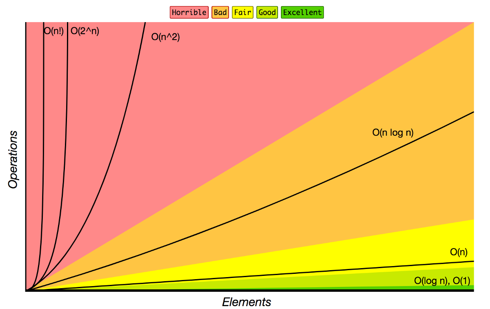

# Big O Notation

## What

- Compare the performance of two or more algorithms numerically.

## An example

Consider a problem to find the sum of all numbers upto a given number n;
Here are two ways to do that:

1. Using a for loop:

```javascript
function addToSum(num) {
  let sum = 0;
  for (let i = 1; i <= num; i++) {
    sum += i;
  }
  return sum;
}
```

2. Using math formula:

```javascript
function addToSumFast(num) {
  return (num * (num + 1)) / 2;
}
```

If we compare the time required to compute the sum of first billion digits, we find that the second algorithm is about 100 times faster. But time taken for execution is not a very good measure to compare two algorithms as:

1. _Time of execution varies_ from machine to machine and even execution to execution on the same machine.
2. When _comparing two similarly performing algorithms_, the absolute time of execution may not be able to determine the faster algorithm due to lack of precesion.

## A Solution:

Instead of counting time of execution, what if we count the number of operations. But do we mean by an operaion? Operations include the following:

1. Mathematical Operations: +, \*, -, /, %
2. Comparisions: ==, <=, >=, ===
3. Assignment: let i = 5, a = 4

In the math formula version of our code, for any input size of num, we perform 3 operations. On the other hand in the for loop code, the number of operations we perform depends linearly on n (4n + 1).

So we can say that the number of operations in the for loop algorithm is _proportional to n_ and in the math algorithm is _proportional to a constant_.

> Project Idea: Make a js tool that takes in a function as input and plots its time vs n curve

## Definition:

The Big O notation allows us to formally talk about the performance of an algorithm.

> Big O : The Big O of an algorithm is **O(f(n))** if the number of operations involved in the algorithm is of the order of some multiple of f(n) as n grows.

Thus the big O of the for loop example above is **O(n)**
and for the math formula is **O(1)**

| Algorithm        | Big O    | proportional to |
| ---------------- | -------- | --------------- |
| for loop         | O(n)     | n               |
| math formula     | O(1)     | 1 or constant   |
| linear search    | O(n)     | n               |
| binary search    | O(log n) | log n           |
| quadratic search | O(n^2)   | n^2             |

### Thumb Rules:

1. Constants don't matter: O(4n + 6) => O(n)
2. Smaller quantities don't matter: O(4n<sup>2</sup> + 3n + 2)=> O(n<sup>2</sup>)
3. Analyse the trend as n approaches infinity
4. Arithmetic operations are constant
5. Variable assignment is constant
6. Accessing elements in an array (by index) or object (by key) is constant
7. In a loop, the complexity is the length of the loop times the complexity of whatever happens inside the loop

We have analyze the runtime of an algorithms as size of input increases.

---

## Space Complexity

Time complexity indicates how much time program takes. Similarly, space complexity indicates how much space a program takes. While estimating the time complexity of an algorithm, we considered the number of operations. Here, while calculating the space complexity, we will consider the number of _declarations_:

Auxiliary Space: The space or memory used by an algorithm is called auxiliary space. The space required by an algorithm is equal to the sum of the following two components:

1. Space used by input
2. Space used by auxiliary variables

> Space Complexity of an algorithm is the total space taken by the algorithm with respect to the input size.

3. Declaring primitive datatypes takes constant space:

```javascript
// All have O(1) space
let i = 0;
const a = null;
var isHappy = true;
```

2. Strings, Arrays, Sets etc. take linear space proportional to their size:

```javascript
// All have O(n) space
let arr = [1, 2, 3, 4, 5];
const word = "Hello World!";
```

_The same thumb rules apply as the ones for time complexity._

3. Reference types are generally O(n) space, where n is the number of keys in the object or length of the array.

```javascript
// O(n) space
let obj = {
  name: "John",
  age: 20,
  isHappy: true,
};
```

## Examples:

1. O(1):

```javascript
function sum(array) {
  let total = 0; //first declaration
  for (const num of array) {
    //second declaration
    total += num;
  }
  return total;
}
```

Note: In the for of loop, `num` is declared only once but assigned multiple number of times

2. O(n):

```javascript
function doubleArray(array) {
  let doubleArray = [];
  for (const num of array) {
    doubleArray.push(2 * num);
  }
  return doubleArray;
}
```

Since we declare an array here, the space complexity depends linearly with its length. Hence the space complexity here is O(n) or O(array.length)

# Logarithms

## What

- Logarithms are the inverse of exponentiation.
- Logarithms are the number of times you can divide a number by 2 before you get a value that's less than or equal to one.

## Syntax

- log<sub>b</sub>x = y means x = b<sup>y</sup>
- log<sub>2</sub>(value) = exponent means 2<sup>exponent</sup> = value

## Examples

1. log<sub>2</sub>8 = 3
2. log<sub>2</sub>64 = 6
3. log<sub>2</sub>1 = 0

## Properties and explanation of BIG O Notation

1. O(n)

O(n) is basically

```javascript
function sum(array) {
  let total = 0;
  for (const num of array) {
    total += num;
  }
  return total;
}
```

## Review

Time complexity counts number of _Operations_
Space complexity counts number of _Declarations_

