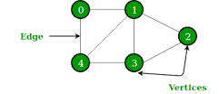

# Graphs

## Introduction

A graph is a non-linear data structure that can be looked at as a collection of vertices (or nodes) potentially connected by line segments named edges.

A graph data structure consists of a finite (and possibly mutable) set of vertices or nodes or points, together with the set unordered pair of these vertices for an undirected graph or a set of ordered pairs for a directed graph.

- Nodes + Connections
- Nodes are sometimes referred to as vertices
- Edges are sometimes referred to as links

Interconnected Nodes. Superset of trees.



## Use

1. Social Network
2. Networks or routing algorithms
3. Google Maps
4. Recommendation Engines
5. Visual Hierarchy
6. File System Optimizations

## Graphs vs Trees:

In trees, for going from one node to another, there is only one path whereas for graphs, there may be multiple paths.

## Terminology

1. **Vertice**: Nodes of the graph
2. **Edge**: Connections between nodes
3. **Directed Graph**: Graph in which we can traverse an edge in only one way. Eg: Instagram Followers Graph
4. **Undirected Graph**: Graph in which nodes can be traversed in both directions. Eg: Facebook Friends Graph
5. **Unweighted Graph**: Edges have no value associated with them.
6. **Weighted Graph**: Edges have some value associated with them.

## Representing Graphs

There are two ways of representing graphs:

1. Adjacency Matrix:

   - Takes up more space (in sparse graphs)
   - Slower to iterate over all edges
   - Faster to lookup specific edge

Is a matrix of size VxV where V is the number of Vertices.
The matrix for the above graph would be:

```
		0	1	2	3	4
	=======================
	0	0	1	0	0	1

	1	1	0	1	1	1

	2	0	1	0	1	0

	3	0	1	1	0	1

	4	1	1	0	1	0

```

2. Adjacency List:

   - Can take up less space (in sparse graphs)
   - Faster to iterate over all edges
   - Can be slower to lookup specific edge

Graph is stored in a list or hashmap:

```javascript
[
	[1, 4],//0
	[4, 3, 2],//1
	[1, 3],//2
	[1, 4, 2],//3
	[0, 1, 3],//f
]

{
	0 : [1, 4],
	1 : [4, 3, 2],
	2 : [1, 3],
	3 : [1, 4, 1],
	4 : [0, 1, 3],
}
```

## Adjacency Matrix vs Adjacency Lists

V - Number of vertices
E - Number of edges

| Operation     | Adjacency Matrix                       | Adjacency List                            |
| ------------- | -------------------------------------- | ----------------------------------------- |
|               | Takes up more space (in sparse graphs) | Can take up less space (in sparse graphs) |
|               | Slower to iterate over all edges       | Faster to iterate over all edges          |
|               | Faster to lookup specific edge         | Can be slower to lookup specific edge     |
| Add Vertex    | O(1)                                   | O(\|V^2\|)                                |
| Add Edge      | O(1)                                   | O(1)                                      |
| Remove Vertex | O(\|V^2\|)                             | O(\|V\| + \|E\|)                          |
| Remove Edge   | O(1)                                   | O(\|E\|)                                  |
| Query         | O(1)                                   | O(\|V\|)                                  |
| Storage       | O(\|V\| + \|E\|)                       | O(\|V^2\|)                                |

## Why we will be using Adjacency List?

- Takes up less space (in sparse graphs)
- Faster to iterate over all edges
- Can be slower to lookup specific edge

## Complexity Comparision

1. Add Vertex:

Matrix: O(v<sup>2</sup>)
List: O(1)

```js
// Adjacency Matrix pseudocode
// 1 - write a method called addVertex, which accepts a name of a vertex
// 2 - it should add a key to the adjacency list with the name of the vertex and set its value to be an empty array

addVertex(vertex) {
	this.adjacencyList[vertex] = [];
}
```

```js
class Graph {
  constructor() {
    this.adjacencyList = {};
  }

  addVertex(vertex) {
    if (!this.adjacencyList[vertex]) this.adjacencyList[vertex] = [];
  }
}

let g = new Graph();
g.addVertex("Tokyo");
g.addVertex("Dallas");
g.addVertex("Aspen");
g.addVertex("Los Angeles");
g.addVertex("Hong Kong");
```

2. Add Edge:

Matrix: O(1)
List: O(1)

```js
// Adjacency Matrix pseudocode
// 1 - This function should accept two vertices, we can call them vertex1 and vertex2
// 2 - The function should find in the adjacency list the key of vertex1 and push vertex2 to the array
// 3 - The function should find in the adjacency list the key of vertex2 and push vertex1 to the array
// 4 - Don't worry about handling errors/invalid vertices

addEdge(vertex1, vertex2) {
	this.adjacencyList[vertex1].push(vertex2);
	this.adjacencyList[vertex2].push(vertex1);
}
```

```js
class Graph {
  constructor() {
    this.adjacencyList = {};
  }

  addVertex(vertex) {
    if (!this.adjacencyList[vertex]) this.adjacencyList[vertex] = [];
  }

  addEdge(vertex1, vertex2) {
    this.adjacencyList[vertex1].push(vertex2);
    this.adjacencyList[vertex2].push(vertex1);
  }
}

let g = new Graph();
g.addVertex("Tokyo");
g.addVertex("Dallas");
g.addVertex("Aspen");
g.addVertex("Los Angeles");
g.addVertex("Hong Kong");

g.addEdge("Dallas", "Tokyo");
g.addEdge("Dallas", "Aspen");
g.addEdge("Hong Kong", "Tokyo");
g.addEdge("Hong Kong", "Dallas");
g.addEdge("Los Angeles", "Hong Kong");
g.addEdge("Los Angeles", "Aspen");
```

3. Remove Vertex:

Matrix: O(v<sup>2</sup>)
List: O(v + e)

```js
// Adjacency Matrix pseudocode
// 1 - This function should accept a vertex to remove
// 2 - The function should loop as long as there are any other vertices in the adjacency list for that vertex
// 3 - Inside of the loop, call our removeEdge function with the vertex we are removing and any values in the adjacency list for that vertex
// 4 - delete the key in the adjacency list for that vertex

removeVertex(vertex) {
	while(this.adjacencyList[vertex].length) {
		const adjacentVertex = this.adjacencyList[vertex].pop();
		this.removeEdge(vertex, adjacentVertex);
	}
	delete this.adjacencyList[vertex];
}
```

```js
class Graph {
  constructor() {
    this.adjacencyList = {};
  }

  addVertex(vertex) {
    if (!this.adjacencyList[vertex]) this.adjacencyList[vertex] = [];
  }

  addEdge(vertex1, vertex2) {
    this.adjacencyList[vertex1].push(vertex2);
    this.adjacencyList[vertex2].push(vertex1);
  }

  removeEdge(vertex1, vertex2) {
    this.adjacencyList[vertex1] = this.adjacencyList[vertex1].filter(
      (v) => v !== vertex2
    );
    this.adjacencyList[vertex2] = this.adjacencyList[vertex2].filter(
      (v) => v !== vertex1
    );
  }

  removeVertex(vertex) {
    while (this.adjacencyList[vertex].length) {
      const adjacentVertex = this.adjacencyList[vertex].pop();
      this.removeEdge(vertex, adjacentVertex);
    }
    delete this.adjacencyList[vertex];
  }
}

let g = new Graph();
g.addVertex("Tokyo");
g.addVertex("Dallas");
g.addVertex("Aspen");

g.addEdge("Dallas", "Tokyo");
g.addEdge("Dallas", "Aspen");
g.addEdge("Los Angeles", "Aspen");

g.removeVertex("Dallas");
```

4. Remove Edge:

Matrix: O(1)
List: O(e)

```js
// Adjacency Matrix pseudocode
// 1 - This function should accept two vertices, we'll call them vertex1 and vertex2
// 2 - The function should reassign the key of vertex1 to be an array that does not contain vertex2
// 3 - The function should reassign the key of vertex2 to be an array that does not contain vertex1
// 4 - Don't worry about handling errors/invalid vertices

removeEdge(vertex1, vertex2) {
	this.adjacencyList[vertex1] = this.adjacencyList[vertex1].filter(
		v => v !== vertex2
	);
	this.adjacencyList[vertex2] = this.adjacencyList[vertex2].filter(
		v => v !== vertex1
	);
}
```

```js
class Graph {
  constructor() {
    this.adjacencyList = {};
  }

  addVertex(vertex) {
    if (!this.adjacencyList[vertex]) this.adjacencyList[vertex] = [];
  }

  addEdge(vertex1, vertex2) {
    this.adjacencyList[vertex1].push(vertex2);
    this.adjacencyList[vertex2].push(vertex1);
  }

  removeEdge(vertex1, vertex2) {
    this.adjacencyList[vertex1] = this.adjacencyList[vertex1].filter(
      (v) => v !== vertex2
    );
    this.adjacencyList[vertex2] = this.adjacencyList[vertex2].filter(
      (v) => v !== vertex1
    );
  }
}

let g = new Graph();
g.addVertex("Tokyo");
g.addVertex("Dallas");
g.addVertex("Aspen");

g.addEdge("Dallas", "Tokyo");
g.addEdge("Dallas", "Aspen");
g.addEdge("Los Angeles", "Aspen");

g.removeEdge("Dallas", "Aspen");
```

5. Query:

Matrix: O(1)
List: O(v + e)

6. Storage:

Matrix: O(v<sup>2</sup>)
List: O(v)
