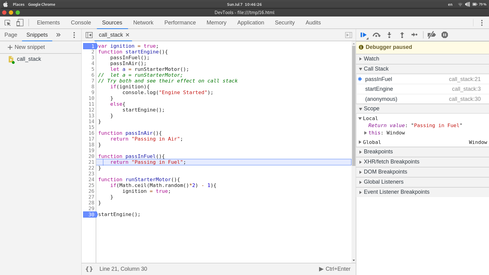

# Recursion

Recursion is

A recursive function is one which calls itself while executing. It works on the divide and conquer strategy. Every recursive function must have a base case to end the recursiveness.

- it's everywhere. (e.g JSON.parse and JSON.stringify())

```js
JSON.parse = function (jsonString) {
  return recurse(JSON.parse, jsonString);
};

function recurse(func, jsonString) {
  // base case
  if (typeof jsonString !== "string") {
    return jsonString;
  }

  // recursive case
  return func(jsonString);
}
```

- `document.getElementById` and DOM tranversal algorithms

```js
document.getElementById = function (id) {
  return recurse(document.getElementById, id);
};

function recurse(func, id) {
  // base case
  if (this.id === id) {
    return this;
  }

  // recursive case
  return func.call(this, id);
}
```

- Object traversal

```js
const traverse = (obj) => {
  for (let key in obj) {
    if (typeof obj[key] === "object") {
      traverse(obj[key]);
    } else {
      console.log(obj[key]);
    }
  }
};
```

- used in more complex data structures.

```js
class Node {
  constructor(val) {
    this.val = val;
    this.next = null;
  }
}

class SinglyLinkedList {
  constructor() {
    this.head = null;
    this.tail = null;
    this.length = 0;
  }
  push(val) {
    const newNode = new Node(val);
    if (!this.head) {
      this.head = newNode;
      this.tail = this.head;
    } else {
      this.tail.next = newNode;
      this.tail = newNode;
    }
    this.length++;
    return this;
  }
  traverse() {
    let current = this.head;
    while (current) {
      console.log(current.val);
      current = current.next;
    }
  }
}
```

- it's sometimes a cleaner alternative to iteration

```js
function collectOddValues(arr) {
  let result = [];

  function helper(helperInput) {
    if (helperInput.length === 0) {
      return;
    }

    if (helperInput[0] % 2 !== 0) {
      result.push(helperInput[0]);
    }

    helper(helperInput.slice(1));
  }

  helper(arr);

  return result;
}
```

## Example

```js
function countDown(num) {
  if (num <= 0) {
    console.log("All done!");
    return;
  }
  console.log(num);
  num--;
  countDown(num);
}
```

```js
function countDown(num) {
  for (let i = num; i > 0; i--) {
    console.log(i);
  }
  console.log("All done!");
}

countDown(5);
```

**Sum of Numbers**

```javascript
function sumOfNum(number) {
  if (number === 1) {
    return 1;
  }
  return number + sumOfNum(number - 1);
}
```

```js
function sumRange(num) {
  if (num === 1) {
    return 1;
  }
  return num + sumRange(num - 1);
}

sumRange(3);
```

## Call Stack

Call stack is a stack data structure which handles the function execution in javascript. It works on Last in First Out (LIFO)

- stack data structure
- LIFO
- function execution
- any time a function is invoked (pushed) on the the top of the call stack
- when javascript sees the return keyword or when the function ends, the compiler will remove (pop)

### Experiment

Try out the following code in the chrome dev console as a snippet and watch the call stack. Add a breakpoint at `startEngine()` and then step one by one and observe the call stack.

```javascript
var ignition = true;
function startEngine() {
  passInFuel();
  passInAir();
  let a = runStarterMotor();
  //  let a = runStarterMotor;
  // Try both and see their effect on call stack
  if (ignition) {
    console.log("Engine Started");
  } else {
    startEngine();
  }
}

function passInAir() {
  return "Passing in Air";
}

function passInFuel() {
  return "Passing in Fuel";
}

function runStarterMotor() {
  if (Math.ceil(Math.random() * 2) - 1) {
    ignition = true;
  }
}

startEngine();
```



> Note: Call Stacks have a limit to their size which is browser dependent. After the call stack size exceeds the limit, the execition will stop and throw an error. This is known as **Stack Overflow!**

## Helper Method Recursion

In this type, recursive method is defined and called inside a main method.

### Example

Write a function that takes in an array and outputs an array with only odd numbers of the previous array.

1. With Helper Method Recursion

```javascript
function getEven(array) {
  let result = [];
  function addIfEven(array) {
    if (array.length == 0) return;
    if (array[0] % 2 == 0) result.push(array[0]);
    addIfOdd(array.slice(1));
  }
  addIfOdd(array);
  return result;
}
```

2. With Pure Recursion Method

All of the functions, with a few exceptions, found in Clojure are pure functions. A function qualifies pure functions if:

- it will always return the same value if given the same arguments.

```js
function getEven(array) {
  if (array.length == 0) return [];
  if (array[0] % 2 == 0) return [array[0]].concat(getEven(array.slice(1)));
  return getEven(array.slice(1));
}
```

- it doesn't produce side effects
- it doesn't depend on any state, or data, change during a program's execution. This is sometimes referred to as deterministic.
- it doesn't modify any external variables or objects — any variables or objects that are used by the function, but defined outside of it.
- it doesn't read external files or data, or input from user during its execution. Pure functions may only call other pure functions.
- it doesn't have any hidden (unintentional) dependencies.

## Pure Recursion Tips

- For arrays, use methods like slice, the spread operator, and concat that make copies of arrays so you do not mutate them.
- Remember that strings are immutable so you will need to use methods like slice, substr, or substring to make copies of strings

```javascript
function getEven(array) {
  let newArray = [];
  if (array.length == 0) return [];
  if (array[0] % 2 == 0) newArray.push(array[0]);
  newArray = newArray.concat(getEven(array.slice(1)));
  return newArray;
}
```

# Writing Factorial Recursively

- It helps you break down bit problems into smaller ones.
- Often, the recursive solution can be simpler to read than the iterative one.

```js
function factorial(num){
  let total = 1;
  for (let i = num: i>1; i--){
    total *= i;
  }
  return total;
}

factorial(4) // 24
```

```js
function factorial(num) {
  if (num === 1) return 1;
  return num * factorial(num - 1);
}

factorial(4); // 24
```

How to write function recursively?

- Identify the base case
- Identify the recursive case
- Get closer and closer and return when needed. Usually you have 2 returns.
- Pass arguments to the function that will immediately reach the base case.
- Identify the arguments that will at least execute the recursive function call once.

```js
function collectOddValues(arr) {
  let result = [];

  function helper(helperInput) {
    if (helperInput.length === 0) {
      return;
    }

    if (helperInput[0] % 2 !== 0) {
      result.push(helperInput[0]);
    }

    helper(helperInput.slice(1));
  }

  helper(arr);

  return result;
}
```

## Common Recursion Pitfalls

- No base case
- Forgetting to return or returning the wrong thing: you will get undefined
- Stack overflow: you will get maximum call stack size exceed

## Example

```js
// no base case
function factorial(num) {
  // if (num === 1) return 1;
  return num * factorial(num - 1);
}

factorial(4); // RangeError: call stack maximum size exceeded
```

```js
// forgetting to return or returning the wrong thing
function factorial(num) {
  // if (num === 1) return 1;
  if (num === 1) console.log(1);
  return num * factorial(num - 1);
}

factorial(4); // RangeError:
```

```js
// stack overflow
function factorial(num) {
  if (num === 1) return 1;
  return num * factorial(num - 1);
}

factorial(5); // RangeError: call stack maximum size exceeded
```
