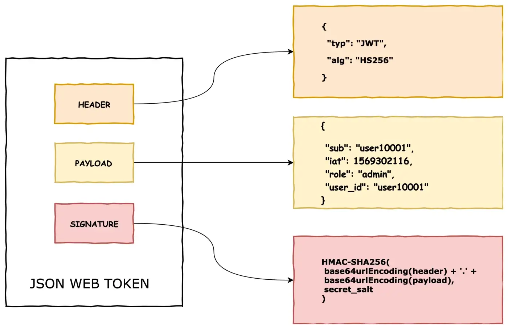

# JWT

## What is JWT?

JSON Web Token (JWT) is an open standard ([RFC 7519](https://tools.ietf.org/html/rfc7519)) that defines a compact and self-contained way for securely transmitting information between parties as a JSON object. This information can be verified and trusted because it is digitally signed. JWTs can be signed using a secret (with the HMAC algorithm) or a public/private key pair using RSA.

The purpose of using JWT is not to hide data but to ensure the authenticity of the data. JWT is signed and encoded, not encrypted.

## How JWT works?

JWT is a string that contains three parts separated by dots (.), which are:

* Header
* Payload
* Signature

### Header

The header typically consists of two parts: the type of the token, which is JWT, and the signing algorithm being used, such as HMAC SHA256 or RSA.

For example:

```json
{
  "alg": "HS256",
  "typ": "JWT"
}
```

Then, this JSON is Base64Url encoded to form the first part of the JWT.

### Payload

The second part of the token is the payload, which contains the claims. Claims are statements about an entity (typically, the user) and additional data. There are three types of claims: reserved, public, and private claims.

* Reserved claims: These are a set of predefined claims which are not mandatory but recommended, to provide a set of useful, interoperable claims. Some of them are: `iss`, `exp`, `sub`, `aud`, and `iat`.

* Public claims: These can be defined at will by those using JWTs. But to avoid collisions they should be defined in the IANA JSON Web Token Registry or be defined as a URI that contains a collision resistant namespace.

* Private claims: These are the custom claims created to share information between parties that agree on using them and are neither registered or public claims.

An example of payload could be:

```json
{
  "sub": "1234567890",
  "name": "John Doe",
  "admin": true
}
```

The payload is then Base64Url encoded to form the second part of the JSON Web Token.

### Signature

To create the signature part you have to take the encoded header, the encoded payload, a secret, the algorithm specified in the header, and sign that.

For example if you want to use the HMAC SHA256 algorithm the signature will be created in the following way:

```js
HMACSHA256(
  base64UrlEncode(header) + "." +
  base64UrlEncode(payload),
  secret)
```

The signature is used to verify the message wasn't changed along the way. This signature is used to verify the message wasn't changed along the way.



## How to use JWT?

### Create a JWT

To create a JWT you have to use a library that supports JWT. In this example we will use [jsonwebtoken](

## References

* [JWT](https://jwt.io/introduction/)
* [JSON Web Token (JWT) - Wikipedia](https://en.wikipedia.org/wiki/JSON_Web_Token)
* [JSON Web Token (JWT) - IETF](https://tools.ietf.org/html/rfc7519)
* [JSON Web Token (JWT) - IANA](https://www.iana.org/assignments/jwt/jwt.xhtml)
* [JSON Web Token (JWT) - MDN](https://developer.mozilla.org/en-US/docs/Web/HTTP/Authentication#JSON_Web_Token_(JWT))
* [JSON Web Token (JWT) - Auth0](https://auth0.com/docs/jwt)


